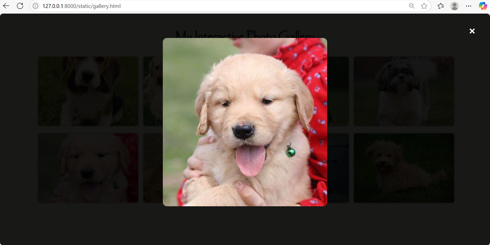

# Ex.08 Design of Interactive Image Gallery

## AIM
  To design a web application for an inteactive image gallery with minimum five images.

## DESIGN STEPS

## Step 1:

Clone the github repository and create Django admin interface

## Step 2:

Change settings.py file to allow request from all hosts.

## Step 3:

Use CSS for positioning and styling.

## Step 4:

Write JavaScript program for implementing interactivit

## Step 5:

Validate the HTML and CSS code

## Step 6:

Publish the website in the given URL.

## PROGRAM
gallery.html
```html
<!DOCTYPE html>

<head>
    <title>Interactive Photo Gallery</title>
    <link rel="stylesheet" href="style.css">
</head>

<body>
    <h1>My Interactive Photo Gallery</h1>
    <div class="gallery">
        
        
        
        
        
        
        
        
    </div>


    <div id="modal" class="modal" onclick="closeModal()">
        <span class="close">&times;</span>
        
    </div>

    <script src="script.js"></script>
</body>
```

style.css
```css
body {
    font-family: Papyrus;
    text-align: center;
    background-color: beige;
    margin: 0;
    padding: 20px;
}

h1 {
    margin-bottom: 20px;
}

.gallery {
    display: grid;
    grid-template-columns: repeat(auto-fit, minmax(250px, 1fr));
    gap: 15px;
    max-width: 1200px;
    margin: 0 auto;
    padding: 10px;
}

.gallery img {
    width: 100%;
    height: 200px;
    /* fixed height for uniformity */
    object-fit: cover;
    border: 3px solid #ccc;
    border-radius: 10px;
    cursor: pointer;
    transition: 0.3s;
}

.gallery img:hover {
    border-color: #333;
    transform: scale(1.03);
}

.modal {
    display: none;
    position: fixed;
    z-index: 10;
    left: 0;
    top: 0;
    width: 100%;
    height: 100%;
    overflow: auto;
    background-color: rgba(0, 0, 0, 0.9);
}

.modal-content {
    margin: auto;
    display: block;
    max-width: 90%;
    max-height: 80vh;
    margin-top: 5%;
    border-radius: 12px;
}

.close {
    position: absolute;
    top: 20px;
    right: 40px;
    color: white;
    font-size: 40px;
    font-weight: bold;
    cursor: pointer;
}
```

script.js
```css
function openModal(image) {
    const modal = document.getElementById("modal");
    const modalImg = document.getElementById("modalImage");
    modal.style.display = "block";
    modalImg.src = image.src;
}

function closeModal() {
    const modal = document.getElementById("modal");
    modal.style.display = "none";
}
```


## OUTPUT

 

 



## RESULT
  The program for designing an interactive image gallery using HTML, CSS and JavaScript is executed successfully.
